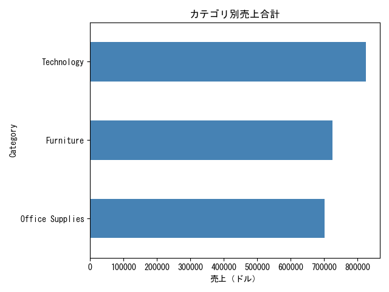
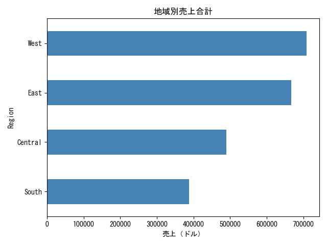
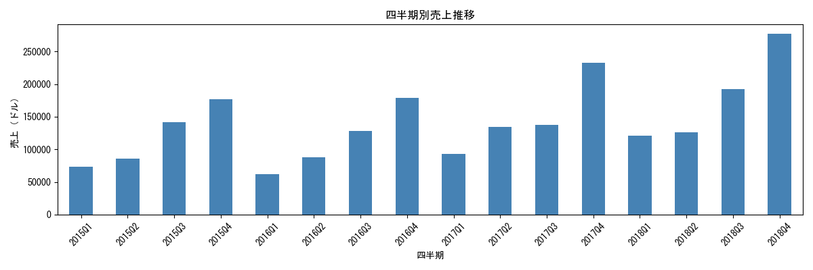
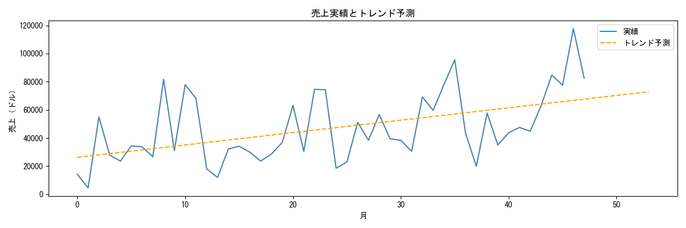
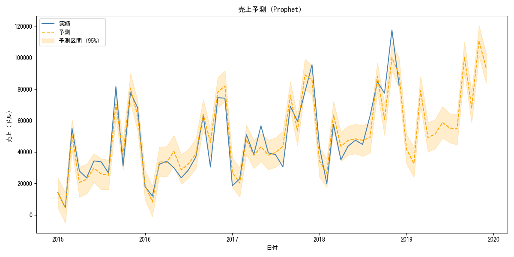

# 🛒 小売売上データ分析・予測プロジェクト

## 概要

Kaggleの公開データセット（Sample Superstore）を用いた小売店の売上分析プロジェクトです。
カテゴリ・地域・時系列の多角的な可視化と、機械学習による売上予測モデルの構築を行いました。

---

## 📊 分析内容

### 1. カテゴリ別売上分析
- 商品カテゴリ（Furniture / Office Supplies / Technology）ごとの売上合計を可視化
- 売れ筋カテゴリと収益性の傾向を把握



### 2. 地域別売上分析
- 米国4地域（East / West / Central / South）ごとの売上比較
- 地域ごとの売上規模と傾向を可視化



### 3. 四半期別売上トレンド
- 年次・四半期単位の売上推移を可視化
- Q4に売上が増加する季節性を確認



### 4. 売上予測モデル（線形回帰 → Prophet）

#### 線形回帰による初期モデル
線形回帰で売上予測を実装した結果、トレンド（長期的な増加傾向）は捉えられているものの、
実績値との乖離が大きいことが判明した。

原因を分析した結果、線形回帰は時間の一次関数しか表現できず、
売上データに存在する季節性を完全に無視していることがわかった。



#### Prophetへの改善

線形回帰からProphetへ切り替えた理由は以下の2点である。

1. 予測値が日時の関数、つまり連続量から連続量への一変数関数として表現できるため、
   フーリエ級数による近似が適用可能である
2. 四半期別売上グラフからQ4に売上が増加する周期性が確認できており、
   フーリエ級数がその周期パターンを学習できると判断した

Prophetは内部でフーリエ級数を使い、売上データを「トレンド」と「季節性」に分解して学習する。
これにより予測線が季節パターンを反映した形となり、精度が改善された。



**予測精度（月別売上、平均46,918ドル）**

| 指標 | 値 |
|---|---|
| MAE（平均絶対誤差） | 5,868ドル |
| RMSE（二乗平均平方根誤差） | 7,476ドル |
| MAPE（平均絶対誤差率） | 12.5% |

---

## 🔧 使用技術

| カテゴリ | 技術・ライブラリ |
|---|---|
| 言語 | Python 3.x |
| データ操作 | pandas |
| 可視化 | matplotlib |
| 機械学習 | scikit-learn |
| 時系列予測 | Prophet |
| 実行環境 | Jupyter Notebook |

---

## 📁 ファイル構成
sales-analysis/
├── sales_analysis.ipynb         # メインの分析ノートブック
├── category_sales.png           # カテゴリ別売上グラフ
├── region_sales.png             # 地域別売上グラフ
├── quarterly_sales.png          # 四半期別売上グラフ
├── sales_prediction.png         # 売上予測グラフ（線形回帰）
├── sales_prediction_prophet.png # 売上予測グラフ（Prophet）
├── requirements.txt             # 依存ライブラリ一覧
└── README.md
---

## 🚀 実行方法

### 1. リポジトリをクローン
```bash
git clone https://github.com/YamakawaTomoya/sales-analysis.git
cd sales-analysis
```

### 2. ライブラリをインストール
```bash
pip install -r requirements.txt
```

### 3. データを準備
Kaggle から「Sample - Superstore」データセットをダウンロードし、
`sales_analysis.csv` としてプロジェクトルートに配置してください。

- [Kaggle データセットページ](https://www.kaggle.com/datasets/vivek468/superstore-dataset-final)

### 4. Notebook を実行
```bash
jupyter notebook sales_analysis.ipynb
```

---

## 📌 今後の予定

- [x] Facebook Prophet による時系列予測モデルの追加（線形回帰との精度比較）
- [ ] 商品サブカテゴリ・顧客セグメント別の詳細分析
- [ ] Streamlit による Web アプリ化

---

## 👤 作者

**Yamakawa Tomoya**
Java,Python,SQL を用いたサーバサイドエンジニア。

- GitHub: [@YamakawaTomoya](https://github.com/YamakawaTomoya)